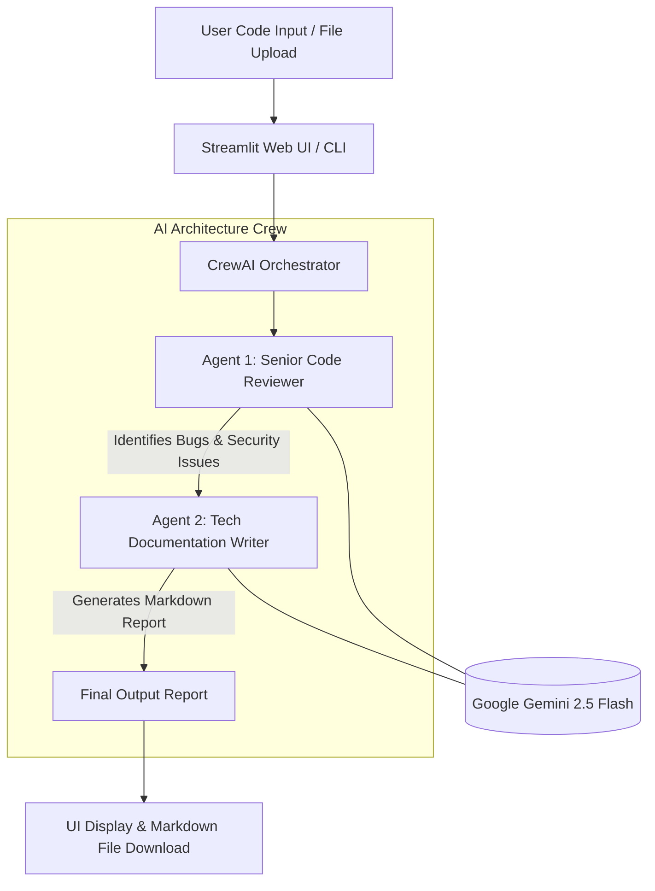

# 🤖 AI Code Review & Documentation Agent

[](https://www.python.org/)
[](https://streamlit.io/)
[](https://www.crewai.com/)
[](https://ai.google.dev/)
[](LICENSE)

An intelligent multi-agent AI system powered by **CrewAI** and **Google Gemini 2.5 Flash** that automatically performs deep code reviews, detects security vulnerabilities, identifies bugs, and generates professional Markdown documentation for your codebase.

---

## ✨ Key Features

- 🕵️‍♂️ **Multi-Agent Architecture (CrewAI)**:
  - **Senior Code Reviewer Agent**: Inspects source code for security vulnerabilities, logic errors, edge cases, and performance bottlenecks.
  - **Technical Documentation Writer Agent**: Transforms technical findings into clear, structured Markdown reports with actionable code recommendations.
- ⚡ **Powered by Gemini 2.5 Flash**: Utilizes Google's fast and state-of-the-art LLM model for high-accuracy analysis.
- 🎨 **Modern Streamlit Web UI**:
  - Upload code files (`.py`, `.java`, `.js`, `.ts`, `.html`, `.css`, `.cpp`).
  - Direct code editor / text pasting options.
  - Multi-language support dropdown (Python, Java, JavaScript, TypeScript, C++, HTML/CSS, etc.).
- 📥 **One-Click Export**: Download generated code review & documentation reports directly as `.md` files.
- 💻 **CLI & Web UI Modes**: Flexible execution via command line terminal or interactive web dashboard.

---

## 🏗️ Architecture & Workflow



---

## 🛠️ Tech Stack

- **Framework**: [CrewAI](https://www.crewai.com/) (Sequential Multi-Agent Process)
- **LLM Engine**: `gemini-2.5-flash` via [Google Gemini API](https://ai.google.dev/)
- **Frontend / Web UI**: [Streamlit](https://streamlit.io/)
- **Language**: Python 3.10+
- **Environment Management**: `python-dotenv`

---

## 🚀 Getting Started

### Prerequisites

- **Python**: `3.10` or higher installed.
- **Gemini API Key**: Get a free API key from [Google AI Studio](https://aistudio.google.com/).

### Installation

1. **Clone the Repository**:
   ```bash
   git clone https://github.com/chathunga2007/AI-Code-Review-Agent.git
   cd AI-Code-Review-Agent
   ```

2. **Create & Activate Virtual Environment**:
   - **Windows (PowerShell)**:
     ```powershell
     python -m venv venv
     .\venv\Scripts\activate
     ```
   - **macOS / Linux**:
     ```bash
     python3 -m venv venv
     source venv/bin/activate
     ```

3. **Install Dependencies**:
   ```bash
   pip install crewai streamlit python-dotenv
   ```

4. **Configure Environment Variables**:
   Create a `.env` file in the root directory and add your API key:
   ```env
   GEMINI_API_KEY=your_google_gemini_api_key_here
   ```

---

## 💻 Usage

### 1. Launch the Streamlit Web Application (Recommended)

Run the following command in your terminal:
```bash
streamlit run app.py
```
This opens the interactive Web Application in your browser at `http://localhost:8501`.

**How to use the Web App:**
1. Select your target programming language in the sidebar.
2. Choose your input method (Upload Code File or Paste Code Text).
3. Click **🚀 Run AI Review & Generate Docs**.
4. View the live analysis report and click **📥 Download Markdown Report** to save it!

---

### 2. Run in CLI Mode

You can also run the terminal script directly:
```bash
python agent.py
```

---

## 📁 Project Structure

```
AI-Code-Review-Agent/
│
├── .env                # Environment variables (GEMINI_API_KEY)
├── .gitignore          # Git ignore rules
├── agent.py            # CLI entry point using CrewAI & Gemini
├── app.py              # Streamlit Web App entry point
├── sample.py           # Code snippet buffer for evaluation
└── README.md           # Project documentation
```

---

## 🤝 Contributing

Contributions, issues, and feature requests are welcome! Feel free to open an issue or pull request.

---

## 📜 License

Distributed under the MIT License.

---

<p align="center">
  Developed By ❤️ <a href="https://github.com/chathunga2007">Chathunga Bimsara</a>
</p>